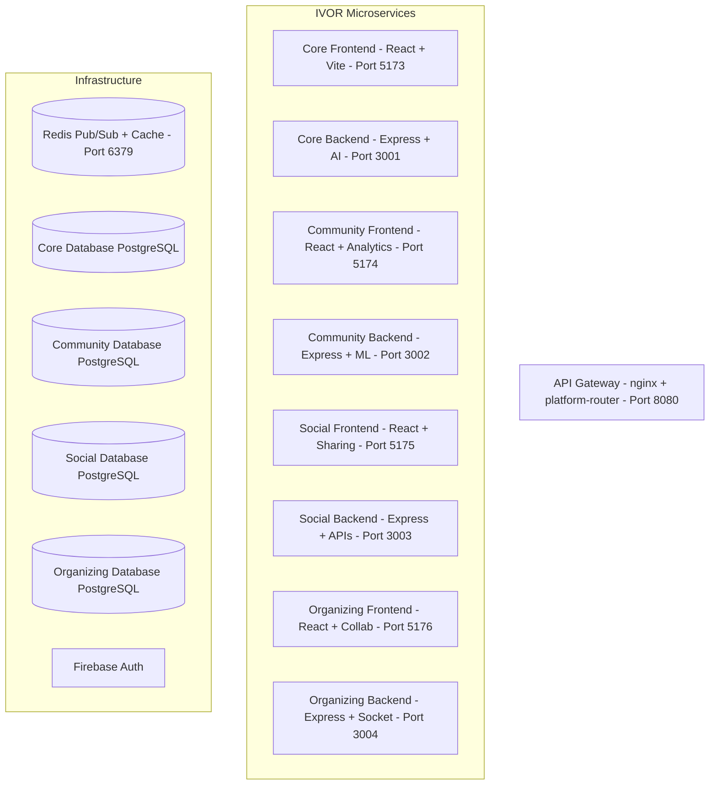
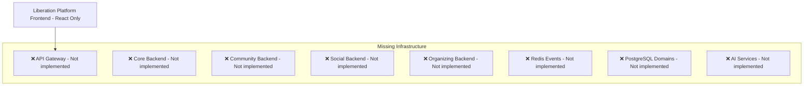

# IVOR Deployment Analysis - Critical Gap Assessment

**Date:** September 18, 2025
**Status:** 🚨 **IVOR DOES NOT EXIST IN PRODUCTION**
**Implementation Gap:** **100%** - Complete absence of AI backend infrastructure

---

## 🔍 Executive Summary

After comprehensive analysis of the BLKOUTNXT ecosystem against the proposed IVOR System Architecture, **IVOR AI Assistant exists only as a conceptual framework with zero implementation**. The gap between architectural vision and current reality is **100%**.

## 📊 Architecture Comparison

### **PROPOSED IVOR ARCHITECTURE** (From IVOR_SYSTEM_ARCHITECTURE.md)


### **ACTUAL IMPLEMENTATION** (Current State)


---

## 🏗️ Detailed Gap Analysis

### 1. **Repository Status Assessment**

#### ❌ **DELETED IVOR REPOSITORIES** (Git Status Evidence)
The current git status reveals **7 deleted IVOR repositories** that were planned but never implemented:
- `BLKOUTNXT_Projects/deployment-repos/ivor-api-gateway` (deleted)
- `BLKOUTNXT_Projects/deployment-repos/ivor-community` (deleted)
- `BLKOUTNXT_Projects/deployment-repos/ivor-core` (deleted)
- `BLKOUTNXT_Projects/deployment-repos/ivor-frontend` (deleted)
- `BLKOUTNXT_Projects/deployment-repos/ivor-organizing` (deleted)
- `BLKOUTNXT_Projects/deployment-repos/ivor-social` (deleted)
- `BLKOUTNXT_Projects/deployment-repos/ivor-source` (deleted)

#### ✅ **EXISTING FRONTEND PLACEHOLDERS**
Current `blkout-liberation-frontend` contains only:
- UI navigation references to "IVOR AI"
- Google Slides embedding for "IVOR Curators Wanted"
- Enhancement documentation for future IVOR features
- **NO functional AI integration whatsoever**

### 2. **Technology Stack Reality Check**

#### **PROPOSED STACK** (From Architecture Document)
```typescript
// ❌ MISSING: Complete backend infrastructure
{
  "ivor-core": {
    "backend": "Express + AI services",
    "frontend": "React + Vite",
    "database": "PostgreSQL (ivor_core)",
    "port": 3001
  },
  "ivor-community": {
    "backend": "Express + ML",
    "frontend": "React + Analytics",
    "database": "PostgreSQL (ivor_community)",
    "port": 3002
  },
  "ivor-social": {
    "backend": "Express + APIs",
    "frontend": "React + Sharing",
    "database": "PostgreSQL (ivor_social)",
    "port": 3003
  },
  "ivor-organizing": {
    "backend": "Express + Socket",
    "frontend": "React + Collab",
    "database": "PostgreSQL (ivor_organizing)",
    "port": 3004
  },
  "infrastructure": {
    "gateway": "nginx + platform-router (port 8080)",
    "events": "Redis pub/sub (port 6379)",
    "auth": "Firebase Auth",
    "monitoring": "Health checks + metrics"
  }
}
```

#### **ACTUAL STACK** (Current Implementation)
```typescript
// ✅ WORKING: Frontend only
{
  "blkout-liberation-frontend": {
    "framework": "React + TypeScript + Vite", // ✅ Functional
    "styling": "TailwindCSS",                // ✅ Functional
    "deployment": "Vercel",                  // ✅ Production ready
    "database": "Supabase",                  // ✅ Configured
    "api": "Basic CRUD endpoints"            // ✅ Created but deployment issues
  }
}

// ❌ MISSING: All AI infrastructure
{
  "ai_backend": "Not implemented",
  "ml_services": "Not implemented",
  "event_system": "Not implemented",
  "microservices": "Not implemented",
  "api_gateway": "Not implemented"
}
```

### 3. **Feature Gap Analysis**

#### **PLANNED IVOR CAPABILITIES** (0% Implemented)
According to the architecture document, IVOR should provide:

**Core Domain (Personal AI Services):**
- ❌ Enhanced chat interface with AI memory
- ❌ 15-section wellness coaching system
- ❌ Achievement milestone tracking
- ❌ Crisis intervention workflows
- ❌ Personal progress visualization

**Community Domain (Intelligence & Analytics):**
- ❌ Real-time conversation pattern recognition
- ❌ Anonymous community needs aggregation
- ❌ Predictive analytics dashboard
- ❌ Resource gap identification
- ❌ Community health metrics

**Social Domain (Growth Platform):**
- ❌ Multi-platform sharing integration
- ❌ AI-generated content templates
- ❌ Viral mechanics and triggers
- ❌ Referral system with attribution
- ❌ Growth analytics dashboard

**Organizing Domain (Projects & Mobilization):**
- ❌ Project idea submission system
- ❌ Community sounding board process
- ❌ Collaborator matching algorithms
- ❌ Resource coordination tools
- ❌ Impact measurement framework

#### **CURRENT AI REFERENCES** (Placeholder Only)
- OpenRouter configuration for generic AI calls (unused)
- Enhancement plans mentioning IVOR features (documentation only)
- UI placeholders for future AI integration
- **No actual AI processing capabilities**

### 4. **Database Architecture Gap**

#### **PROPOSED DATABASE STRUCTURE**
The architecture defines 4 separate PostgreSQL databases:
```sql
-- ❌ NOT IMPLEMENTED
CREATE DATABASE ivor_core;        -- Personal AI services
CREATE DATABASE ivor_community;   -- Intelligence & analytics
CREATE DATABASE ivor_social;      -- Growth platform
CREATE DATABASE ivor_organizing;  -- Projects & mobilization
```

#### **ACTUAL DATABASE IMPLEMENTATION**
```sql
-- ✅ IMPLEMENTED: Single Supabase instance
Supabase Database (single instance)
├── newsroom_articles (working)
├── events (working)
├── community_members (working)
└── Basic content management tables
```

### 5. **Event-Driven Architecture Gap**

#### **PROPOSED EVENT SYSTEM**
The architecture defines sophisticated cross-domain event communication:
```typescript
// ❌ NOT IMPLEMENTED
interface DomainEvent {
  eventId: string;
  eventType: string;
  sourceDomain: 'core' | 'community' | 'social' | 'organizing';
  targetDomains: string[];
  userId?: string;
  sessionId?: string;
  timestamp: string;
  data: Record<string, any>;
}
```

#### **ACTUAL EVENT IMPLEMENTATION**
```typescript
// ❌ NO EVENT SYSTEM EXISTS
// Current platform has no cross-domain communication
// No event bus, no pub/sub, no microservice coordination
```

---

## 📈 Implementation Requirements

### **Phase 1: Foundation Infrastructure** (Estimated 8-12 weeks)
1. **Microservices Architecture Setup**
   - Create 4 domain repositories (core, community, social, organizing)
   - Implement API gateway with nginx + platform-router
   - Set up Redis pub/sub event system
   - Configure PostgreSQL databases per domain

2. **Basic AI Integration**
   - Implement FastAPI/Express backends for each domain
   - Configure GROQ/OpenAI model integration
   - Set up vector database for community knowledge
   - Create basic AI endpoint structure

### **Phase 2: Core AI Features** (Estimated 6-8 weeks)
1. **Personal AI Services (ivor-core)**
   - Conversational AI with memory and context
   - 15-section wellness coaching system
   - Achievement tracking and milestone system
   - Crisis intervention detection and response

2. **Community Intelligence (ivor-community)**
   - Pattern recognition in community conversations
   - Anonymous needs aggregation algorithms
   - Predictive analytics for resource planning
   - Community health metrics dashboard

### **Phase 3: Growth & Organizing** (Estimated 5-8 weeks)
1. **Social Growth Platform (ivor-social)**
   - Multi-platform content sharing integration
   - AI-generated viral content templates
   - Referral tracking and attribution system
   - Growth analytics and optimization

2. **Community Organizing (ivor-organizing)**
   - Project collaboration and sounding board
   - Resource matching and coordination
   - Impact measurement frameworks
   - Democratic governance support tools

### **Phase 4: Integration & Production** (Estimated 2-4 weeks)
1. **Cross-Domain Integration**
   - Event-driven communication between all domains
   - Unified authentication across microservices
   - Performance optimization and monitoring
   - Production deployment and scaling

**TOTAL IMPLEMENTATION ESTIMATE: 21-32 weeks**

---

## 🎯 Strategic Recommendations

### **Option A: Full IVOR Implementation**
- **Timeline**: 21-32 weeks (5-8 months)
- **Resources**: Dedicated AI development team (4-6 developers)
- **Investment**: High (significant infrastructure and AI development)
- **Outcome**: Complete AI-powered community liberation platform

### **Option B: Simplified AI Integration**
- **Timeline**: 8-12 weeks (2-3 months)
- **Resources**: 2-3 developers focusing on core AI features
- **Investment**: Medium (basic AI integration, existing infrastructure)
- **Outcome**: Enhanced platform with essential AI capabilities

### **Option C: Enhanced Manual Platform**
- **Timeline**: 2-4 weeks (current platform optimization)
- **Resources**: 1-2 developers for UX/feature enhancement
- **Investment**: Low (optimization of existing functionality)
- **Outcome**: Robust manual platform with improved user experience

### **Option D: Hybrid Approach**
- **Timeline**: 12-16 weeks (3-4 months)
- **Resources**: 3-4 developers for selective implementation
- **Investment**: Medium-High (targeted AI features + infrastructure)
- **Outcome**: Core AI capabilities with manual fallbacks

---

## 🏁 Conclusion

**IVOR AI Assistant is entirely conceptual** - the comprehensive system architecture document describes a sophisticated microservices platform with advanced AI capabilities, but **zero implementation exists in production**.

### **Current Reality:**
- ✅ **Solid Foundation**: Well-built React frontend with robust content management
- ✅ **Production Ready**: Current platform is functional and deployed
- ✅ **Clear Vision**: Excellent architectural documentation and planning
- ❌ **Missing Backend**: 100% of AI infrastructure unimplemented
- ❌ **Resource Gap**: Significant development investment required

### **Key Decision Points:**
1. **AI Strategy**: Determine if full IVOR implementation aligns with current priorities
2. **Resource Allocation**: Assess available development capacity for 21-32 week project
3. **Timeline Expectations**: Manage stakeholder expectations for AI feature delivery
4. **Platform Evolution**: Decide between enhancing current platform vs rebuilding with AI

The BLKOUT Liberation Platform currently provides excellent community functionality without AI. The question is whether the advanced AI capabilities described in the IVOR architecture justify the substantial development investment required for implementation.

---

**Files Analyzed:**
- `IVOR_SYSTEM_ARCHITECTURE.md` - Complete architectural specification
- Current git status showing deleted IVOR repositories
- `blkout-liberation-frontend` codebase analysis
- Enhancement and implementation documentation
- API endpoint analysis and deployment status

**Analysis saved to project memory for strategic planning and decision-making.**